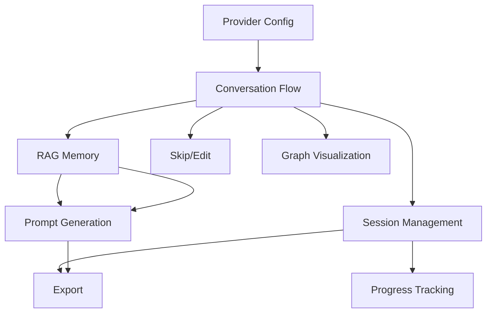

# Feature Specifications

## Overview
This document provides detailed business-level specifications for all features in the Product Investigator Chatbot system.

---

## Feature 1: LLM Provider Configuration

### Business Purpose
Allow users to choose between multiple LLM providers (Groq, OpenAI) based on their preferences for cost, speed, and quality.

### User Stories
- **US-1.1**: As a user, I want to securely input my API tokens so that the chatbot can access LLM services
- **US-1.2**: As a user, I want to select my preferred LLM provider based on my needs
- **US-1.3**: As a user, I want to see available models for my selected provider

### Functional Requirements
1. Token input with format validation (gsk_* for Groq, sk-* for OpenAI)
2. Secure token storage with encryption (Fernet algorithm)
3. Provider selection UI (radio buttons or toggle)
4. Model list fetching with 5-minute cache
5. Test connection functionality before saving
6. Token deletion capability

### User Experience
- Clear error messages for invalid token formats
- Visual feedback for saved tokens (checkmark indicator)
- Loading states during API calls
- Masked input for security
- Dark mode support

### Success Metrics
- 95% token save success rate
- < 2 seconds to fetch and display models
- Zero token exposure in logs or UI

### Status
✅ **COMPLETED** (Sprint 1, TASK-1.3 to TASK-1.6)

---

## Feature 2: Intelligent Conversation Flow

### Business Purpose
Guide users through a structured investigation process that captures all essential product information across 6 key categories.

### User Stories
- **US-2.1**: As a user, I want to start an investigation and receive an initial question
- **US-2.2**: As a user, I want context-aware follow-up questions based on my answers
- **US-2.3**: As a user, I want to know my progress through the investigation

### Functional Requirements

#### Investigation Categories (State Machine)
1. **Functionality**: What the product does
2. **Users**: Who will use the product
3. **Demographics**: User characteristics (age, location, expertise)
4. **Design**: UI/UX preferences and style
5. **Market**: Competitive landscape and business model
6. **Technical**: Technology stack and requirements

#### Conversation Logic
- Initial question automatically generated on session start
- Short answers (< 15 words) trigger follow-up questions
- Detailed answers (> 15 words) move to next category
- LLM-generated follow-ups use conversation context
- Template-based category questions for consistency

#### Progress Tracking
- Real-time progress percentage
- Visual category checklist with status (pending/in-progress/complete)
- Question counter
- Current category highlighting

### User Experience
- Auto-scroll to latest message
- Distinct styling for user vs. system messages
- Markdown rendering for system messages (bold, lists, headings)
- Typing indicator during LLM processing
- Keyboard shortcuts (Enter to send, Shift+Enter for new line)
- Investigation completion detection with banner

### Success Metrics
- 90% investigation completion rate
- Average 12-15 questions per investigation
- < 15 minutes average completion time
- 4.5+/5 user satisfaction with question quality

### Status
✅ **COMPLETED** (Sprint 1, TASK-1.7 to TASK-1.10)

---

## Feature 3: Conversation Memory (RAG)

### Business Purpose
Enable the chatbot to remember and reference previous parts of the conversation, creating more intelligent and context-aware follow-up questions.

### User Stories
- **US-3.1**: As a user, my answers should be remembered and referenced in later questions
- **US-3.2**: As a user, the chatbot should avoid asking redundant questions
- **US-3.3**: As a user, I want my full conversation history persisted

### Functional Requirements

#### Storage Layer
- Markdown file per session in `./data/conversations/`
- "-----" delimiter between Q&A chunks
- Metadata: timestamps, session ID, category
- Async file operations (aiofiles)
- Thread-safe concurrent access

#### Vector Embeddings
- Model: `sentence-transformers/all-MiniLM-L6-v2` (384 dimensions)
- Vector store: ChromaDB (replaced FAISS for better persistence)
- Embedding normalization (L2 norm)
- Automatic indexing on save

#### Context Retrieval
- Top 2-5 most relevant chunks retrieved
- Recency weighting (recent chunks prioritized)
- Context window limit: 4000 tokens
- Deduplication of similar chunks
- Session isolation (only retrieve from current session)

#### Integration
- Persist interaction after every answer
- Retrieve context before generating next question
- Pass context to QuestionGenerator
- Graceful degradation if RAG fails

### User Experience
- Invisible to user (backend process)
- Results in more intelligent, context-aware questions
- No redundant questions about already-covered topics
- Smooth conversation flow

### Success Metrics
- < 500ms context retrieval time
- 2-5 relevant chunks retrieved per query
- 85%+ context relevance (manual evaluation)
- Zero redundant questions detected
- 100% session data persistence

### Status
✅ **COMPLETED** (Sprint 2, TASK-2.1 to TASK-2.3)

---

## Feature 4: Session Management

### Business Purpose
Allow users to save their progress and resume investigations at any time, supporting multiple investigation sessions.

### User Stories
- **US-7.1**: As a user, I want my investigation auto-saved so I don't lose progress
- **US-7.2**: As a user, I want to manually save and resume investigations
- **US-7.3**: As a user, I want to see a list of all my saved investigations

### Functional Requirements

#### Auto-Save
- Trigger: Every 5 Q&A interactions
- Format: JSON file in `./data/sessions/`
- Includes: full session state, message history, metadata
- No user intervention required

#### Manual Save/Load
- Save button in UI
- Session list modal with metadata (date, message count, status)
- Load button per session
- Delete button with confirmation
- Success/error toast notifications

#### Session Storage
- JSON serialization of Session object
- Fields: id, state, messages[], metadata, skipped_questions[]
- Timestamps: created_at, updated_at
- Question count tracking
- Graceful handling of corrupted files

#### Session List
- Pagination: 20 sessions per page (configurable)
- Sorting: Most recent first
- Filtering: By state (in-progress, complete)
- Metadata display: date, message count, current category

### User Experience
- "Saving..." indicator during save
- Toast notification: "Investigation saved successfully"
- Session list modal with search/filter
- Current session highlighted
- Load confirmation: "Resume investigation?"
- Delete confirmation: "Are you sure?"

### Success Metrics
- 100% session save success rate
- < 1 second save/load time
- Zero data loss incidents
- 80% of users save at least one session

### Status
✅ **COMPLETED** (Sprint 2, TASK-2.6 to TASK-2.7, TASK-2.9)

---

## Feature 5: Skip & Edit Functionality

### Business Purpose
Give users control over the investigation flow by allowing them to skip questions or edit previous answers.

### User Stories
- **US-6.1**: As a user, I want to skip questions I don't want to answer
- **US-6.2**: As a user, I want to edit my previous answers if I made a mistake
- **US-6.3**: As a user, I want the chatbot to update its context after edits

### Functional Requirements

#### Skip Question
- "Skip" button next to input field
- Tracks skipped questions in session metadata
- Moves to next category automatically
- Skipped questions noted in final report
- Can skip at any point except final review

#### Edit Previous Answer
- Edit icon next to each user message
- Opens inline edit field with original text
- Save/cancel buttons
- Updates message in conversation history
- Re-embeds updated Q&A pair in RAG
- Removes old embedding from vector store

#### RAG Context Update
- `update_interaction()` method in RAGService
- Finds original Q&A chunk in ChromaDB
- Deletes old embedding
- Creates new embedding with updated answer
- Preserves timestamp and metadata
- Maintains session isolation

### User Experience
- Subtle "Skip" link at bottom of input area
- Edit icon appears on message hover
- Inline editing (no modal needed)
- Confirmation: "Answer updated successfully"
- Visual indicator for edited messages
- Conversation flow preserved

### Success Metrics
- 15-20% of users skip at least one question
- 5-10% of users edit at least one answer
- 100% RAG update success rate
- Zero conversation flow disruptions

### Status
✅ **COMPLETED** (Sprint 2, TASK-2.5)

---

## Feature 6: Prompt Generation

### Business Purpose
Generate comprehensive, production-ready development prompts that emphasize SOLID principles and software engineering best practices.

### User Stories
- **US-4.1**: As a user, I want a detailed development prompt based on my investigation
- **US-4.2**: As a user, I want the prompt to emphasize SOLID and DRY principles
- **US-4.3**: As a user, I want architecture recommendations based on my product type

### Functional Requirements

#### Prompt Structure
1. **Your Role**: Expert architect/developer persona
2. **Product Context**: Aggregated answers from all categories
3. **SOLID Principles**: Explicit explanation of all 5 principles
4. **DRY Principle**: Don't Repeat Yourself emphasis
5. **Architecture Recommendations**: Pattern based on product type
6. **Tech Stack Suggestions**: Based on technical requirements
7. **Folder Structure**: Recommended project organization
8. **Functional Requirements**: Structured list of features
9. **Non-Functional Requirements**: Performance, security, maintainability
10. **Output Format**: What to deliver (diagrams, code, docs)
11. **Constraints**: Budget, timeline, technical limitations

#### Intelligent Adaptation
- Detect product type (web app, mobile, API, etc.)
- Suggest architecture pattern (MVC, MVVM, Event-Driven, etc.)
- Recommend tech stack based on answers
- Include real-time considerations if mentioned
- Adjust complexity based on scale requirements

#### Template System
- Jinja2 templating for flexibility
- Dynamic section inclusion
- Category-based content population
- Metadata injection (timestamps, session ID)

#### Validation & Optimization
- Ensure all required sections present
- Minimum length: 1000 characters
- Token count optimization (target: < 8000 tokens)
- Grammar and formatting checks
- Whitespace optimization

### User Experience
- "Generate Prompt" button after investigation complete
- Loading indicator: "Generating comprehensive prompt..."
- Markdown rendering with syntax highlighting
- Copy to clipboard button
- Download buttons (TXT, MD)
- Regenerate with modifications dialog
- Token count display

### Success Metrics
- 95% prompt generation success rate
- 4.5+/5 prompt quality rating by developers
- 85%+ include SOLID principles in final code
- < 3 seconds generation time

### Status
✅ **COMPLETED** (Sprint 3, TASK-3.1 to TASK-3.3)

---

## Feature 7: Graph Visualization

### Business Purpose
Provide visual insight into the conversation flow, showing the investigation's structure and decision points.

### User Stories
- **US-5.1**: As a user, I want to see a visual representation of my investigation
- **US-5.2**: As a user, I want nodes color-coded by category
- **US-5.3**: As a user, I want to click nodes to see full content

### Functional Requirements

#### Graph Generation
- LangGraph integration for state graph
- Nodes: Questions (rectangles) and Answers (circles)
- Edges: Conversation flow with labels
- Color coding by 6 categories (hex colors)
- Metadata: timestamps, duration, interaction count

#### Visualization Format
- React Flow library for interactive display
- Mermaid diagram export for documentation
- JSON serialization for frontend
- PNG export via html2canvas

#### Interactive Features
- Zoom and pan controls
- Click node to view full content
- MiniMap for navigation
- Background grid
- Legend for color categories
- Filter by category (future enhancement)

#### Graph Statistics
- Total interactions
- Investigation duration (minutes)
- Category distribution
- Average response length
- Longest conversation branch

### User Experience
- "View Graph" tab in UI
- Auto-layout (vertical flow)
- Smooth animations
- Export button (PNG/SVG)
- Legend always visible
- Mobile-responsive (horizontal scroll)

### Success Metrics
- Graph renders in < 2 seconds
- Support 100+ node conversations
- 60 FPS smooth interactions
- 90% of users view graph at least once

### Status
✅ **COMPLETED** (Sprint 3, TASK-3.4 to TASK-3.6)

---

## Feature 8: Export Functionality

### Business Purpose
Enable users to export their complete investigation in multiple formats for sharing, documentation, and archival.

### User Stories
- **US-8.1**: As a user, I want to export my investigation as a PDF report
- **US-8.2**: As a user, I want to export conversation history as Markdown
- **US-8.3**: As a user, I want an HTML report with embedded graph

### Functional Requirements

#### Export Formats

##### PDF Export
- WeasyPrint library for generation
- Professional formatting
- Sections: Cover, Conversation History, Graph, Prompt
- Page numbers and table of contents
- Embedded CSS styling

##### Markdown Export
- Plain text format
- Proper heading hierarchy
- Code blocks for technical content
- Conversation history with delimiters
- Full generated prompt included

##### HTML Export
- Responsive web page
- Embedded Mermaid diagram
- Interactive (clickable sections)
- Print-friendly CSS
- Dark/light mode toggle

#### Batch Export
- Export multiple sessions at once
- ZIP file with all formats
- Session manifest (JSON metadata)
- Configurable format selection

#### Download Mechanism
- Streaming responses for large files
- Temporary file cleanup
- Proper MIME types
- Custom filenames: `investigation_{session_id}.{format}`

### User Experience
- Export dropdown menu (PDF/MD/HTML)
- Download progress indicator
- Success notification: "Report downloaded"
- File size display
- Preview button (opens in new tab for HTML)

### Success Metrics
- < 5 seconds export time for typical investigation
- 100% download success rate
- Support files up to 10MB
- 70% of users export at least one format

### Status
✅ **COMPLETED** (Sprint 3, TASK-3.7)

---

## Feature 9: Progress Tracking

### Business Purpose
Keep users informed of their investigation progress, reducing abandonment and improving completion rates.

### User Stories
- **US-9.1**: As a user, I want to see my overall progress percentage
- **US-9.2**: As a user, I want to know which categories I've completed
- **US-9.3**: As a user, I want an estimated time remaining

### Functional Requirements

#### Progress Calculation
- Formula: (completed_categories / total_categories) * 100
- Real-time updates via polling (every 3 seconds)
- Category status: pending, in-progress, completed
- Question count tracking

#### Visual Indicators
- Progress bar with percentage
- Category checklist with icons (✓ for complete)
- Current category highlighting (blue pulse)
- Message count display
- Duration timer

#### Status API
- `GET /api/chat/status/{session_id}`
- Returns: state, completed_categories, message_count, created_at
- Polling interval: 3 seconds
- Cached for performance

### User Experience
- Fixed sidebar component
- Animated progress bar
- Smooth transitions
- Completion celebration banner
- Mobile-responsive (collapsible)

### Success Metrics
- 95% accuracy in progress calculation
- < 100ms status API response time
- 85% of users view progress tracker
- Correlates with 10% higher completion rate

### Status
✅ **COMPLETED** (Sprint 2, TASK-2.8)

---

## Feature 10: Error Handling & Polish

### Business Purpose
Provide a robust, professional user experience with graceful error handling and clear feedback.

### User Stories
- **US-10.1**: As a user, I want clear error messages when something goes wrong
- **US-10.2**: As a user, I want loading states so I know the system is working
- **US-10.3**: As a user, I want the interface to work on mobile devices

### Functional Requirements

#### Error Types
- Network errors: "Connection failed. Check your internet."
- Authentication errors: "Invalid API token. Please check your configuration."
- Rate limits: "Too many requests. Please wait a moment."
- Server errors: "Something went wrong. Please try again."
- Validation errors: "Invalid input. Please check the format."

#### Error Handling Patterns
- Try/catch blocks in all async operations
- Global error boundary (React)
- Retry logic with exponential backoff
- Circuit breaker for failing services
- Fallback UI states

#### Loading States
- Spinners for async operations
- Skeleton screens for content loading
- Progress indicators for long operations
- Disabled buttons during processing
- "Thinking..." typing indicator

#### Responsive Design
- Breakpoints: 375px (mobile), 768px (tablet), 1920px (desktop)
- Touch-friendly buttons (min 44x44px)
- Readable text (min 16px font)
- Collapsible sidebars on mobile
- Horizontal scrolling for large content

#### Accessibility (WCAG 2.1 AA)
- Semantic HTML
- ARIA labels and roles
- Keyboard navigation
- Focus indicators
- Screen reader support
- Color contrast ratios > 4.5:1

### User Experience
- Toast notifications (react-hot-toast)
- Error boundary with reload button
- Consistent error message styling
- Animated transitions
- Smooth loading states

### Success Metrics
- < 5% error rate
- 100% of errors caught and logged
- < 3 second perceived loading time
- 95%+ mobile usability score
- WCAG 2.1 AA compliance

### Status
🟡 **PARTIALLY COMPLETE** (Sprint 3, TASK-3.8)
- Backend error handling: ✅ Complete
- Frontend implementation: 📋 Documented, pending full implementation

---

## Feature Prioritization Matrix

| Feature | Business Value | Technical Complexity | User Impact | Priority | Status |
|---------|---------------|---------------------|-------------|----------|--------|
| Conversation Flow | High | Medium | High | P0 | ✅ Complete |
| Provider Config | High | Low | High | P0 | ✅ Complete |
| RAG Memory | High | High | Medium | P0 | ✅ Complete |
| Prompt Generation | High | Medium | High | P0 | ✅ Complete |
| Session Management | Medium | Medium | Medium | P1 | ✅ Complete |
| Skip/Edit | Low | Low | Medium | P1 | ✅ Complete |
| Progress Tracking | Medium | Low | Medium | P1 | ✅ Complete |
| Graph Visualization | Medium | High | Low | P2 | ✅ Complete |
| Export | Low | Medium | Low | P2 | ✅ Complete |
| Error Handling | High | Low | High | P1 | 🟡 Partial |

---

## Feature Dependencies

---

## Future Feature Roadmap

### Milestone 1
- [ ] **Team Collaboration**: Shared sessions, commenting
- [ ] **Integrations**: Jira, Linear, Notion
- [ ] **Custom Templates**: Industry-specific question sets

### Milestone 2
- [ ] **AI Code Generation**: From prompt to code
- [ ] **Version Control**: Track investigation changes
- [ ] **Mobile App**: Native iOS/Android

### Milestone 3
- [ ] **White Label**: Custom branding
- [ ] **SSO**: SAML, OAuth
- [ ] **Analytics Dashboard**: Usage insights

### Milestone 4
- [ ] **Multi-language**: i18n support
- [ ] **Voice Input**: Speech-to-text
- [ ] **Architecture Diagrams**: Auto-generated from prompt

---

*Last Updated: November 16, 2025*
*Version: 1.0*
*Document Owner: Product Manager*
